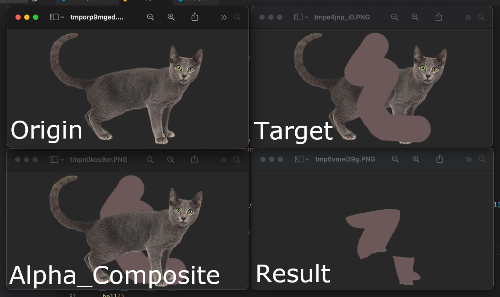

# AlphaBlendTest



## Environments

- Python 3.9.10+
- PILLOW 9.0.1+
- Click 8.0.4+

## How to use

```
$ python3 main.py --help
Usage: main.py [OPTIONS]

Options:
  --origin-path TEXT  Original image path
  --target-path TEXT  Target image path
  --help              Show this message and exit.
```
